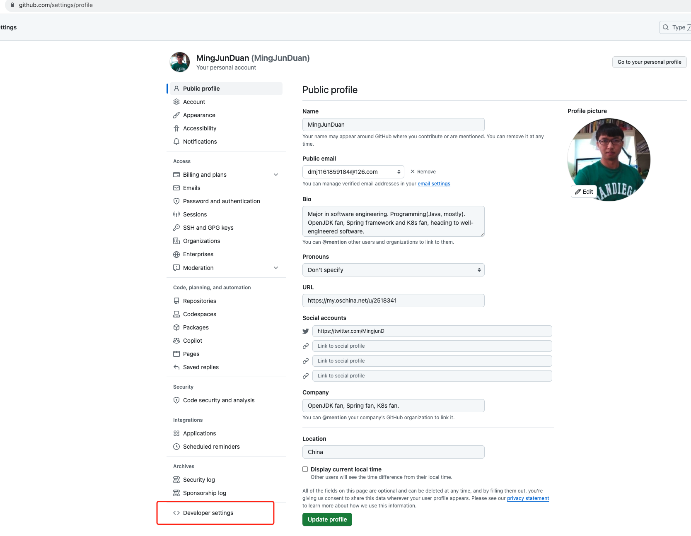
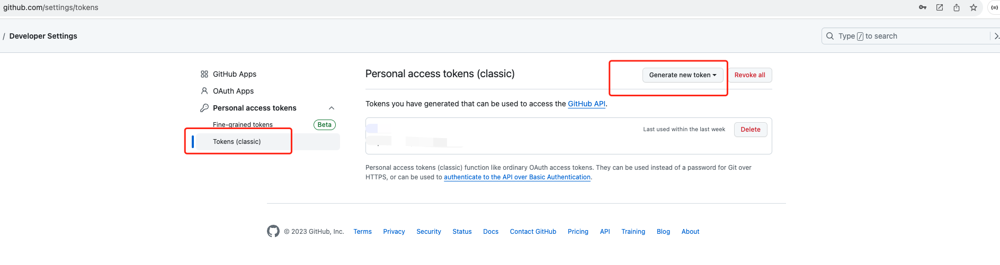
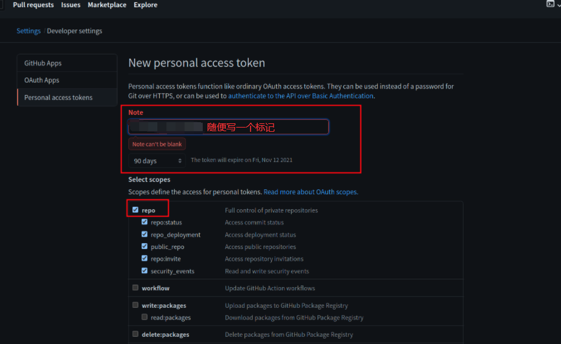

```remote: Support for password authentication was removed on August 13, 2021```

Github原先的密码凭证从2021年8月13日开始就不能用了，必须使用个人访问令牌(personal access token)，就是把你的密码替换成token.

Settings中选择Developer settings



选择'Personal access tokens'然后生成新的token


设置权限


本地项目仓库目录下执行如下命令设置token，后续就可以直接git pull/push
```
git remote set-url origin https://<your_token>@github.com/<USERNAME>/<REPO>.git

// <your_token>：换成你自己得到的token
// <USERNAME>：是你自己github的用户名
// <REPO>：是你的仓库名称
```

